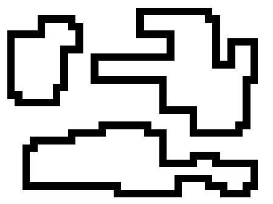
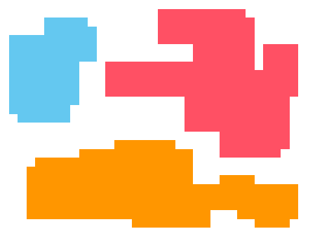

# FillAllClosedElemsImg

## Preview
1. This project uses jdk 11;
2. I recommend that when creating an image for testing, make it 40 by 40 pixels in size. 
3. Result program you can see in console also you can see in image in the address:  `src/main/resources/img_res/result.png`.
4. You must change the value `private static final int COUNT_OBJECT = YOUR_VALUE;`
of the constant to control the number of objects in the image in Logic class.
5. To specify which image to read and process, you need to change the path to the image in the Main class `BufferedImage image = ImageIO.read(new File(
   "src\\main\\resources\\img_ex\\YOUR_IMAGE.bmp"));`.
6. You must create image using pixels, the outline should be thin, 
i.e. there should not be a situation where there are 4 pixels 
like in the picture on the right. 
 In image u can see the desired pixel above, and below it does not match the rules.
7. Code was updating, u can color any shapes in the image.
8. If u find bag in code, tell me please 🙏
## Program testing
 
